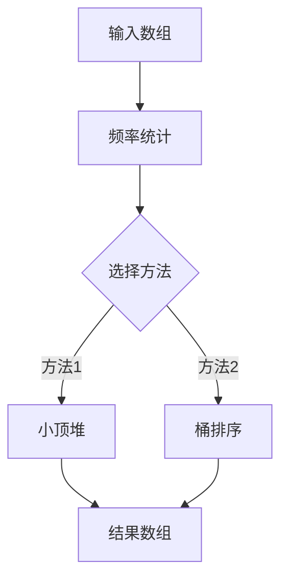

# 一网打尽！用堆和桶排序找出最受欢迎的前K个元素！

## JavaScript 背诵版答案

- [ ] 第一次独立完成
- [ ] 不看答案写出
- [ ] 1 天后复习
- [ ] 7 天后复习
- [ ] 30 天后复习

[打开 LeetCode](https://leetcode.com/problems/top-k-frequent-elements/)

```javascript
/**
 * @param {number[]} nums
 * @param {number} k
 * @return {number[]}
 */
var topKFrequent = function(nums, k) {
  const map = new Map();

  nums.forEach(value => map.set(value, (map.get(value) || 0) + 1));

  return [...map]
    .sort((a, b) => b[1] - a[1])
    .slice(0, k)
    .map(([value]) => value)
};
```

> 下方完整保留原题解的中文说明；原文中的 Java 示例统一指向上面的 JavaScript 最终答案。

大家好，我是忍者算法。今天我们来攻克一道非常实用的题目 - LeetCode 347「前K个高频元素」。这个问题不仅在面试中常见，在实际工作中也经常遇到。让我们一起探索几种解决方案！

## 📚 生活中的场景

想象你是一个商场经理，想知道哪些商品最受欢迎。你手上有一串销售记录，需要找出销量前K名的商品。这就是我们今天要解决的问题的现实版本！

## 💡 问题定义

给你一个整数数组 nums 和一个整数 k，请你返回其中出现频率前 k 高的元素。

比如说：
> 本处原 Java 示例已移除；请使用本文开头的 JavaScript 背诵版答案。

## 🤔 解决方案

### 1. 小顶堆解法
> 本处原 Java 示例已移除；请使用本文开头的 JavaScript 背诵版答案。

### 2. 桶排序解法（最优解）
> 本处原 Java 示例已移除；请使用本文开头的 JavaScript 背诵版答案。

## 📝 方法比较

1. **小顶堆法**
   - 时间复杂度：O(nlogk)
   - 空间复杂度：O(n)
   - 优点：适合处理动态数据
   - 缺点：需要额外的堆空间

2. **桶排序法**
   - 时间复杂度：O(n)
   - 空间复杂度：O(n)
   - 优点：最优的时间复杂度
   - 缺点：需要额外的桶空间

## 💡 算法思路解析

### 小顶堆法的思路：
1. 先用哈希表统计每个元素的频率
2. 维护一个大小为k的小顶堆
3. 遍历频率表，更新堆
4. 最后堆中剩下的就是前k个高频元素

### 桶排序法的思路：
1. 同样先统计频率
2. 创建n+1个桶（频率范围是0到n）
3. 根据频率把元素放入对应的桶
4. 从后往前收集k个元素

## 🎯 易错点提醒

1. **频率统计**
   - 别忘了先统计频率
   - 使用HashMap的getOrDefault方法更简洁

2. **堆的比较器**
   - 小顶堆要按频率比较，不是数字本身
   - lambda表达式注意参数顺序

3. **结果收集**
   - 注意收集够k个元素就停止
   - 桶可能为空，要跳过

## 🎨 数据结构图解



## 🌟 面试技巧

1. **先说思路**
   - "我们首先需要统计每个元素的频率"
   - "然后可以用小顶堆或桶排序来找出前k个"

2. **比较方法**
   - 分析各种方法的优缺点
   - 说明在不同场景下的选择

3. **补充优化**
   - 提到空间优化的可能性
   - 讨论处理动态数据的方案

## 🎩 延伸应用

这个问题在实际工作中有很多应用：

1. **热门商品分析**
   - 找出销量最高的商品
   - 实时监控热销商品

2. **网站访问统计**
   - 统计最常访问的页面
   - 分析用户行为模式

3. **系统监控**
   - 发现最频繁的错误类型
   - 优化系统性能瓶颈

---
作者：忍者算法
公众号：忍者算法
🎁 回复【刷题清单】获取LeetCode高频面试题合集
🧑‍💻 回复【代码】获取多语言完整题解
💡 回复【加群】加入算法交流群，一起进步
#算法面试 #LeetCode #堆 #桶排序

这道题告诉我们：有时候换个思路，用不同的数据结构，可以得到更优的解法。如果你对这个话题还有任何疑问，欢迎在评论区讨论！